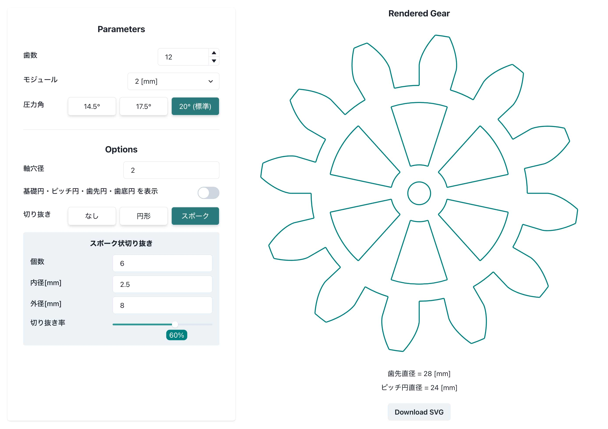

# Gear SVG generator

This application enables users to specify parameters to generate and visualize the shape of an involute gear in SVG format. Users can adjust parameters such as the number of teeth, module, pressure angle, and more, and see the resulting gear shape rendered in real-time.

<!-- 画像を貼り付ける -->
